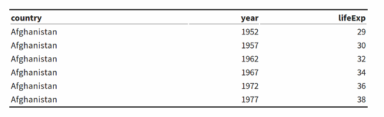
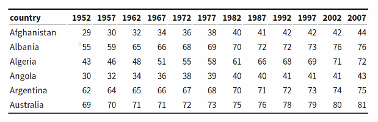

```{r setup, include=FALSE}
knitr::opts_chunk$set(echo = FALSE)
```

## (0) What is ggplot2 !?

* One of multiple graph libraries for R (R Base, Lattice, ggplot2 ...)
* The one considered the best 
* There was a ggplot1 and its successor is the current ggplot2
* package name is ggplot2 but main function inside is called ggplot()

## 3.1 How ggplot works

To create a graph, we need 3 things:

1. data
2. a type of graph
3. a way to map the structure of the data to the structure of the graph

We need to provide those three elements to create a graph with ggplot, in ggplot "words", they are:

1. data 
2. geom_XXX (geom_bar, geom_point)
3. aesthetics mapping (or just aesthetics)

## 3.1 How ggplot works

We need to give those elements to the function ggplot(), some of them go between the parenthesis, some of them are added with +.

## 3.2 Tidy data

We can see data in two different formats

### Long Format



### Wide Format



## Slide with R Output

```{r cars, echo = TRUE}
summary(cars)
```

## Slide with Plot

```{r pressure}
plot(pressure)
```

